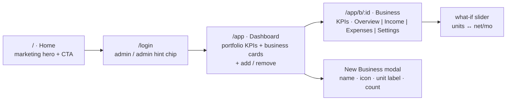

# 18 — **Margin** · Multi-Business Profit/Loss Cockpit

### *"are we making money or losing it?"* — one dashboard for every business you run, in the Untitled UI look, built to be used one-handed on a phone

> You run a few businesses. Add one to the dashboard ("Day Care #1"), feed it its real numbers — *food per kid, the mortgage, staff, the fee each kid pays* — and Margin does the arithmetic that matters: **monthly profit or loss, margin %, and the break-even line** ("you need 9 kids to be in the black"). Portfolio view rolls every business up so one glance tells you which ones carry the others.

**Status:** Kickoff defaulted 2026-08-02 (user away — recommended options locked, veto anything in §9) → ready to build in `~/Desktop/Margin` on your word · **Type:** Vibe-coding springboard · **Design source:** no Figma — built straight from the **Untitled UI** system + the proven NeoGenesis/GenioRoasters component kit · **Origin:** "new idea" prompt · **Date:** 2026-08-02

---

## 0. TL;DR — one surface, phone-first

A **responsive web app** (works beautifully on the phone, installable via PWA) with three layers:

1. **Home page** at `/` — small Untitled-UI marketing hero explaining the product, CTA → login.
2. **Easy login** at `/login` — demo credentials **admin / admin** (shown as a hint chip on the form; this is a demo gate, not security — see §8).
3. **The cockpit** at `/app` — portfolio dashboard (add/remove businesses, rollup KPIs) → tap a business → its P&L: income lines, expense lines, computed profit/loss, expense breakdown donut, and the **what-if slider** (drag the kid count, watch the number flip green/red).

> ### ✅ Decisions locked (v1)
> - **Name:** *Margin* (the metric the whole app exists to answer).
> - **Stack:** Vite + React 19 + TS + **Tailwind v4** (`@theme` tokens) — the exact scaffold proven on NeoGenesis/GenioRoasters. `recharts` for the donut/bars. React Router: `/`, `/login`, `/app`, `/app/b/:id`.
> - **Design system:** Untitled UI — Inter, the gray + brand scales, our existing primitives kit (Button, Input, Card, Badge, Tabs, KpiCard, Drawer, Modal, EmptyState) re-skinned to a finance palette: white paper, gray hairlines, **emerald = profit, red = loss**, one brand accent.
> - **Phone story v1:** responsive-first + PWA manifest ("Add to Home Screen") — **not** a separate Expo app yet (open decision for v2).
> - **Data:** `localStorage` via a typed store — zero backend, survives reload, resets nothing. The typed data layer doubles as the future API contract.
> - **Auth:** mock gate, `admin`/`admin`, session flag in localStorage.
> - **The signature mechanic: per-unit costs.** Every income/expense line is either **fixed** ("mortgage $2,400/mo") or **per-unit** ("food **$150 per kid** per month"). Each business declares its unit ("kid", "customer", "order") and a unit count — the engine multiplies, normalizes, and derives break-even.
> - **Definition of done:** deployed — GitHub repo + Vercel link, verified live on a phone-sized viewport.

---

## 1. The product — what Margin is

| | Detail |
|---|---|
| **Who** | An owner running **several small businesses** (day care, and whatever else is in the portfolio) who wants one honest screen instead of spreadsheets |
| **Core objects** | Business · MoneyLine (income or expense; fixed or per-unit) · Unit (the thing you scale by: kid/customer/order) · Portfolio (the rollup) |
| **Core loop** | Add business → set its unit + count → add expense lines → add income lines → read the verdict (net/mo, margin %, break-even) → adjust → portfolio view compares all businesses |
| **Vibe** | Untitled UI calm: white cards, Inter, generous spacing — but the money number is always the loudest thing on screen, green or red, no ambiguity |

**The worked example (the user's own seed scenario — ships as demo data):**

> **Sunshine Day Care** · unit = "kid" · count = **12**
> Expenses: Mortgage **$2,400/mo** (fixed) · Food **$150/kid/mo** (per-unit) · Staff **$3,200/mo** (fixed) · Insurance **$1,800/yr** (fixed, yearly) · Supplies **$25/kid/mo** (per-unit)
> Income: Tuition **$800/kid/mo** (per-unit)
> → Revenue **$9,600/mo** · Expenses **$7,850/mo** · **Net +$1,750/mo · margin 18.2% · break-even at 9.2 → 10 kids** ✅ in the black

**Second seed (deliberately in the red, so the dashboard demos both states):**

> **Kleen Sweep Cleaning Co** · unit = "client" · count = **8**
> Expenses: Van lease **$450/mo** · Helper **$1,900/mo** · Insurance **$1,200/yr** · Supplies **$45/client/mo**
> Income: Service plan **$320/client/mo**
> → Revenue **$2,560/mo** · Expenses **$2,810/mo** · **Net −$250/mo** 🔴 — break-even at **9 clients**, has 8 → the app literally says *"one more client flips this green"*

---

## 2. ♻️ What we carry over (the reusable machinery)

No Figma file this time — the design source *is* the Untitled UI system we already speak fluently. Reused as-is:

- **Scaffold:** Vite + React 19 + TS + Tailwind v4 `@theme` tokens (NeoGenesis-proven, versions pinned in the build repo's `BLUEPRINT.md`).
- **Component kit:** the Untitled-UI-style primitives from NeoGenesis/GenioRoasters, re-skinned (finance palette above). No new primitive inventions unless a screen demands one.
- **Charts:** `recharts` (donut for expense breakdown, bar for business-vs-business comparison) — same approach as the GenioRoasters web dashboard.
- **The verification habit:** since there's no Figma to diff against, the per-screen check becomes **phone-frame screenshots** (390×844) reviewed against the Untitled UI bar: spacing rhythm, type scale, real empty states, no dead buttons.

---

## 3. Surfaces & IA



- **Dashboard cards:** icon + name + **net/mo badge** (emerald/red) + tiny revenue-vs-expense bar; portfolio header shows *total net across businesses, how many profitable, best & worst performer*. Remove = card menu → confirm dialog (type the business name to confirm — deletion is real).
- **Business detail tabs:** **Overview** (KPI row: Revenue/mo · Expenses/mo · Net/mo · Margin % · Break-even units; donut of expense categories; what-if slider) · **Income** and **Expenses** (line lists with add/edit/delete via a bottom Drawer on mobile) · **Settings** (rename, icon, unit label/count, currency, delete).
- **Mobile behavior:** cards stack single-column, tabs become a segmented control, add-line opens a bottom sheet, KPI row horizontally scrolls. Everything reachable with a thumb.

---

## 4. The math (small on purpose, correct on purpose)

Everything normalizes to **monthly** before comparison:

| Frequency | Monthly factor |
|---|---|
| monthly | × 1 |
| weekly | × 52 ÷ 12 (≈ 4.333) |
| yearly | ÷ 12 |

- **Line value/mo** = `normalize(amount)` if fixed · `normalize(amount) × unitCount` if per-unit.
- **Net/mo** = Σ income − Σ expenses · **Margin %** = net ÷ revenue.
- **Break-even units** = `fixedExpenses ÷ (incomePerUnit − variableExpensePerUnit)` — surfaced as a plain sentence: *"Break-even at 10 kids — you have 12."* (Guarded: if per-unit income ≤ per-unit cost, say so honestly instead of showing a nonsense number.)
- Money handled in **cents (integers)** internally; display via `Intl.NumberFormat`. No floating-point drift in a finance app, even a demo one.

---

## 5. Data model (the future API contract)

```ts
type Frequency = "monthly" | "weekly" | "yearly";
type Kind = "fixed" | "perUnit";
type Category = "rent" | "food" | "staff" | "utilities" | "insurance" | "supplies" | "marketing" | "other";

interface MoneyLine {
  id: string; name: string; category: Category;
  amountCents: number;        // per unit if kind === "perUnit"
  frequency: Frequency; kind: Kind;
}

interface Business {
  id: string; name: string; icon: string; color: string;
  unitLabel: string;          // "kid" | "customer" | "order"…
  unitCount: number;
  income: MoneyLine[]; expenses: MoneyLine[];
  createdAt: string;
}
// store: { businesses: Business[] } ⇄ localStorage("margin.v1")
// derived (never stored): revenueMo, expensesMo, netMo, marginPct, breakEvenUnits, status
```

---

## 6. Screen inventory (build → phone-frame screenshot → verify)

| # | Screen | Built | Verified |
|---|---|---|---|
| 1 | Home `/` — hero, 3 feature cards, CTA | ☐ | ☐ |
| 2 | Login `/login` — admin/admin hint chip, error state | ☐ | ☐ |
| 3 | Dashboard `/app` — portfolio KPIs + cards + add/remove | ☐ | ☐ |
| 4 | New/Edit Business modal | ☐ | ☐ |
| 5 | Business Overview tab — KPIs, donut, break-even, what-if slider | ☐ | ☐ |
| 6 | Income tab + add-line drawer | ☐ | ☐ |
| 7 | Expenses tab + add-line drawer | ☐ | ☐ |
| 8 | Settings tab + delete-confirm | ☐ | ☐ |
| 9 | Empty states (no businesses / no lines) + seeded demo data | ☐ | ☐ |

---

## 7. ⚠️ Security & honesty reality check

- **admin/admin is a stage prop.** Anyone with the URL can log in; the gate exists to demo the flow, not to protect data. The app must say so in the footer ("demo build — data lives in this browser only").
- **Data is device-local.** localStorage = private to that browser; clearing site data erases the books. v2's first job is real auth + sync *if* this graduates from demo to daily tool.
- **Not accounting software.** No tax, depreciation, or accrual logic — it's a planning/clarity cockpit. Label the numbers "estimated monthly" so it never masquerades as the books.

---

## 8. Roadmap

- **v1 (this blueprint):** everything above, seeded with Sunshine Day Care, deployed to Vercel, phone-verified. 
- **v1.1:** CSV export · one-time costs (amortize toggle) · month-by-month actuals vs plan · business duplicate ("template" a new location).
- **v2 (only if it earns it):** real auth + cloud sync (Supabase) · Expo SDK 54 companion app · partners/multi-user · trends over time.

---

## 9. Kickoff — ✅ defaulted 2026-08-02 (user away; veto on review)

> ### 🔒 Defaults locked — flag anything you'd change
> 1. **Name:** **Margin** (alternatives considered: Tally, BlackInk). Renaming later = trivial (one token file + repo name).
> 2. **Phone story:** **responsive web + PWA** — installs to the home screen from the browser, one codebase. Expo native app deferred to v2.
> 3. **Seed portfolio:** Sunshine Day Care (12 kids, profitable) + Kleen Sweep Cleaning Co (8 clients, −$250/mo — shows the red state and the break-even nudge). Currency **USD**. Both are demo data — you'll replace them with your real numbers in the app itself.
> 4. **Next step:** on your go ("build it"), a dedicated workspace `~/Desktop/Margin` gets scaffolded per the Machinist rule — ideas live here, builds live in their own repo — then built screen-by-screen with phone-frame verification, and deployed (GitHub + Vercel) with your confirmation.
